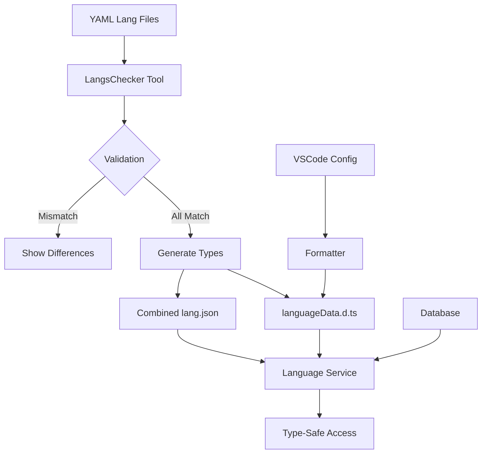

# Multi-Language Type System: Internationalization Made Type-Safe 🌍

## Overview

This is an advanced multi-language validation and type generation system that ensures consistency across all language files while providing complete type safety for internationalization. It automatically validates YAML language files, generates TypeScript interfaces, and provides runtime language loading with full type support.

## The Problem It Solves

Managing multiple language files in a large application typically leads to:
- **Inconsistent keys** across different language files
- **Missing translations** that cause runtime errors
- **No type safety** for language strings
- **Manual validation** of language file structure
- **Tedious maintenance** when adding new keys

## The Solution

A comprehensive system that:
1. **Validates** all language files for consistency
2. **Generates** TypeScript interfaces automatically
3. **Provides** type-safe runtime access
4. **Maintains** formatting consistency
5. **Offers** flexible output options

## Architecture



## Core Components

### 1. Language Validation Engine
**File**: `tools/LangsChecker-Tools.ts`

**Capabilities**:
- **Deep Structure Analysis**: Recursively compares all language files
- **Type Generation**: Creates TypeScript interfaces from YAML structure
- **Difference Detection**: Identifies missing keys, extra keys, and type mismatches
- **Merge Operations**: Combines types from multiple files intelligently

### 2. Runtime Language Service
**File**: `src/core/functions/getLanguageData.ts`

**Features**:
- **Dynamic Loading**: Loads language files on-demand
- **Caching System**: Stores loaded languages in memory
- **Database Integration**: Retrieves user/guild language preferences
- **Fallback Logic**: Defaults to `en-US` when no preference is set

### 3. Type Generation System
**Generated**: `types/languageData.d.ts`

**Provides**:
- **Complete Type Safety**: All language keys are typed
- **IntelliSense Support**: Full autocomplete in IDEs
- **Compile-Time Validation**: Catches missing keys at build time
- **Consistent Structure**: Ensures all files follow the same schema

## Usage Examples

### Command Line Interface

```bash
# Generate TypeScript types (Interactive)
bun run type:lang

# Generate TypeScript types (Automatic)
bun run type:lang --type 2

# Generate combined JSON file
bun run type:lang --type 3
```

### Generated Type Interface

```typescript
// Generated in types/languageData.d.ts
export interface LanguageData {
    commands: {
        help: {
            title: string;
            description: string;
            usage: string;
        };
        ban: {
            success: string;
            error: string;
            reason: string;
        };
    };
    errors: {
        permission: string;
        notFound: string;
        cooldown: string;
    };
    // ... more nested structures
}
```

### Runtime Usage

```typescript
// Type-safe language access
const langData = await getLanguageData(guildId);

// Full type safety and autocomplete
const helpTitle = langData.commands.help.title;        // ✅ string
const banSuccess = langData.commands.ban.success;      // ✅ string
const errorMsg = langData.errors.permission;           // ✅ string

// Compile-time error prevention
const invalid = langData.commands.nonexistent;         // ❌ TypeScript error
```

## Language File Structure

### YAML Format (`src/lang/*.yml`)

```yaml
# en-US.yml
commands:
  help:
    title: "Help Command"
    description: "Shows available commands"
    usage: "!help [command]"
  ban:
    success: "User has been banned successfully"
    error: "Failed to ban user"
    reason: "Reason: {reason}"

errors:
  permission: "You don't have permission to use this command"
  notFound: "Command not found"
  cooldown: "Please wait {time} seconds before using this command again"
```

### Validation Process

1. **Load All Files**: Reads all `.yml` files from `src/lang/`
2. **Parse Structure**: Converts YAML to TypeScript-compatible structure
3. **Compare Files**: Validates that all files have identical structure
4. **Report Differences**: Shows detailed mismatches if found
5. **Generate Types**: Creates comprehensive TypeScript interface

## Advanced Features

### Intelligent Type Merging

When files have slight differences, the system can merge types:

```typescript
// File 1 has: { user: { name: string } }
// File 2 has: { user: { name: string, age: number } }
// Result: { user: { name: string, age: number } }
```

### Detailed Error Reporting

```bash
[x] Mismatch found in file fr-FR.yml compared to en-US.yml
Missing key 'commands.ban.reason' at Root.commands.ban
Extra key 'commands.ban.motif' at Root.commands.ban
Value mismatch at Root.errors.cooldown: string vs number
```

### Flexible Output Options

The system provides multiple output formats:

1. **TypeScript Interface**: For compile-time type safety
2. **Combined JSON**: For runtime bundling and optimization
3. **Validation Report**: For CI/CD pipeline integration

## Performance Optimizations

### Caching Strategy

```typescript
// Language data is cached after first load
const LangsData: LangsData = {};

// Only loads from disk once per language
if (!LangsData[lang]) {
    LangsData[lang] = yaml.load(await readFile(langPath, 'utf8'));
}
```

### Lazy Loading

- Language files are loaded only when requested
- No startup penalty for unused languages
- Memory efficient for large numbers of languages

## Integration Examples

### Discord Bot Command

```typescript
// In a Discord command
export default async function helpCommand(interaction: ChatInputCommandInteraction) {
    const langData = await getLanguageData(interaction.guildId);
    
    const embed = new EmbedBuilder()
        .setTitle(langData.commands.help.title)           // ✅ Typed
        .setDescription(langData.commands.help.description) // ✅ Typed
        .setFooter({ text: langData.commands.help.usage }); // ✅ Typed
    
    await interaction.reply({ embeds: [embed] });
}
```

### Error Handling

```typescript
// Type-safe error messages
function handleError(guildId: string, errorType: keyof LanguageData['errors']) {
    const langData = await getLanguageData(guildId);
    return langData.errors[errorType]; // ✅ Fully typed
}
```

## Configuration

### Project Structure

```
src/
├── lang/
│   ├── en-US.yml
│   ├── fr-FR.yml
│   ├── es-ES.yml
│   └── de-DE.yml
tools/
├── LangsChecker-Tools.ts
└── formatter.ts
types/
└── languageData.d.ts
```

### Package.json Scripts

```json
{
    "scripts": {
        "type:lang": "bun run tools/LangsChecker-Tools.ts",
        "lang:validate": "bun run tools/LangsChecker-Tools.ts --type 1",
        "lang:types": "bun run tools/LangsChecker-Tools.ts --type 2",
        "lang:json": "bun run tools/LangsChecker-Tools.ts --type 3"
    }
}
```

## Benefits

### For Developers

- **Type Safety**: Catch translation errors at compile time
- **IntelliSense**: Full autocomplete for all language keys
- **Consistency**: Guaranteed identical structure across all languages
- **Easy Maintenance**: Add new languages without breaking existing code

### For Translators

- **Structure Validation**: Ensures all required keys are present
- **Clear Errors**: Detailed reports of what's missing or incorrect
- **Format Flexibility**: Use familiar YAML syntax

### For the Project

- **Maintainability**: Automated validation prevents inconsistencies
- **Performance**: Efficient caching and lazy loading
- **Scalability**: Easy to add new languages and keys
- **CI/CD Integration**: Automated validation in build pipelines

## Real-World Example

```bash
# Development workflow
➜ bun run type:lang --type 2
[*] Starting to check 10 lang files!
[LOG]: All typings are identical.
[LOG]: [+] TypeScript definition file created: types/languageData.d.ts

# Result: All language files validated and types generated
# Now you can use fully typed language data throughout your application
```

## Conclusion

This multi-language type system transforms internationalization from a manual, error-prone process into a fully automated, type-safe experience. By combining YAML validation, TypeScript generation, and runtime optimization, it ensures that your application's multi-language support is robust, maintainable, and developer-friendly.

**The result**: A self-validating, type-safe internationalization system that scales with your project and prevents translation-related bugs before they reach production. 🌟