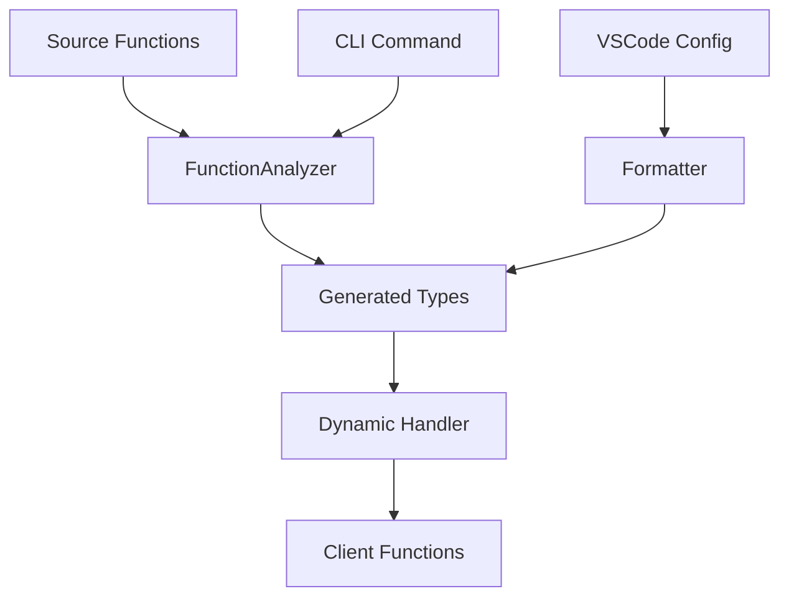

# TypeScript Meta-Programming Ecosystem: The Complete Miracle 🚀

## Overview

This is a sophisticated TypeScript meta-programming system that automatically generates type definitions, dynamically loads functions, and maintains code formatting consistency across a Discord bot project. It's a complete ecosystem that bridges static analysis, dynamic loading, and code formatting.

## The Architecture



## Components Breakdown

### 1. Source Functions (`src/core/functions/*.ts`)
Individual TypeScript files containing exported functions that extend the Discord client functionality.

### 2. Function Analyzer (`tools/Client_Func_Typator.ts`)
A sophisticated TypeScript AST analyzer that:
- **Scans** all TypeScript files in the functions directory
- **Extracts** function signatures, parameters, return types, and generics
- **Generates** complete type definitions with proper namespacing
- **Formats** the output according to VSCode configuration

### 3. Dynamic Handler
Runtime loader that:
- **Discovers** function files automatically
- **Imports** them dynamically
- **Attaches** them to the Discord client instance
- **Provides** type-safe access through `client.func.*`

### 4. Code Formatter
Ensures consistent code style by:
- **Reading** VSCode configuration (`editor.insertSpaces`, `editor.tabSize`, etc.)
- **Applying** formatting rules to generated code
- **Maintaining** project-wide consistency

## The Miracle in Action

### Step 1: Write a Function
```typescript
// src/core/functions/userHelper.ts
export default function getUserData(userId: string, includeStats?: boolean): Promise<UserData> {
    // Implementation
}
```

### Step 2: Generate Types
```bash
bun run type:func
```

This single command:
1. **Analyzes** all function files
2. **Extracts** type information
3. **Generates** complete type definitions
4. **Formats** according to VSCode settings
5. **Writes** to `types/client_functions.d.ts`

### Step 3: Automatic Output
```typescript
// Generated in types/client_functions.d.ts
declare namespace Client_Functions {
    // From userHelper.ts
    export function userHelper(userId: string, includeStats?: boolean): Promise<UserData>;
}
```

### Step 4: Runtime Loading
The handler automatically:
- **Discovers** the new function
- **Loads** it into `client.func`
- **Provides** full type safety

### Step 5: Type-Safe Usage
```typescript
// In your Discord bot
const userData = await client.func.userHelper("123456789", true);
//                     ↑ Fully typed, autocomplete available
```

## Key Features

### 🎯 **Zero Configuration**
- Add a function file → It's automatically discovered
- No manual type definitions needed
- No import statements required

### 🔧 **Advanced Type Analysis**
- **Generics support**: `<T extends SomeType>`
- **Optional parameters**: `param?: type`
- **Complex return types**: `Promise<ComplexType>`
- **Import resolution**: Automatically handles external types

### 📐 **Consistent Formatting**
- Reads VSCode settings automatically
- Applies consistent indentation (tabs/spaces)
- Maintains project code style
- Formats generated code properly

### 🚀 **Dynamic Loading**
- Runtime discovery of functions
- Hot-reloadable (restart to pick up changes)
- Type-safe access through `client.func.*`
- Namespace organization for multiple functions per file

## Code Examples

### Complex Function Analysis
```typescript
// Source function
export async function processUserData<T extends UserType>(
    userId: string,
    options?: ProcessingOptions,
    callback?: (data: T) => void
): Promise<ProcessedResult<T>> {
    // Implementation
}

// Generated type
export function processUserData<T extends UserType>(
    userId: string,
    options?: ProcessingOptions,
    callback?: (data: T) => void
): Promise<ProcessedResult<T>>;
```

### Multiple Functions Per File
```typescript
// Source file: mathUtils.ts
export function add(a: number, b: number): number { /* */ }
export function multiply(a: number, b: number): number { /* */ }

// Generated namespace
export namespace mathUtils {
    export function add(a: number, b: number): number;
    export function multiply(a: number, b: number): number;
}
```

## Configuration

### VSCode Settings (`vsconfig.json`)
```json
{
    "editor.formatOnSave": true,
    "editor.insertSpaces": false,
    "editor.tabSize": 4
}
```

### Package.json Script
```json
{
    "scripts": {
        "type:func": "bun run tools/Client_Func_Typator.ts"
    }
}
```

## Benefits

### For Developers
- **No boilerplate**: Write function, get types automatically
- **Full IntelliSense**: Complete autocomplete and error checking
- **Consistent style**: Automated formatting
- **Easy maintenance**: One command regenerates everything

### For the Project
- **Type safety**: Compile-time error detection
- **Maintainability**: Clear separation of concerns
- **Scalability**: Easy to add new functions
- **Documentation**: Types serve as live documentation

## The "Miracle" Explained

This system achieves what typically requires manual work:

1. **Manual approach**: Write function → Write types → Import manually → Update documentation
2. **This system**: Write function → `bun run type:func` → Everything else is automatic

It's a **meta-programming miracle** because:
- **Static analysis** generates runtime-usable types
- **Dynamic loading** provides static typing
- **Code formatting** maintains consistency automatically
- **Single command** orchestrates the entire pipeline

## Usage in Production

```bash
# During development
bun run type:func  # Regenerate types after adding functions

# In your Discord bot code
client.func.userHelper("123")        // ✅ Typed
client.func.mathUtils.add(1, 2)      // ✅ Typed  
client.func.nonExistent()            // ❌ Compile error
```

## Conclusion

This TypeScript ecosystem demonstrates the power of meta-programming by creating a seamless bridge between static analysis and runtime functionality. It transforms a typically manual and error-prone process into a single command that maintains type safety, code consistency, and developer productivity.

**The result**: A self-maintaining, type-safe, and scalable function system that grows with your project automatically. 🎉